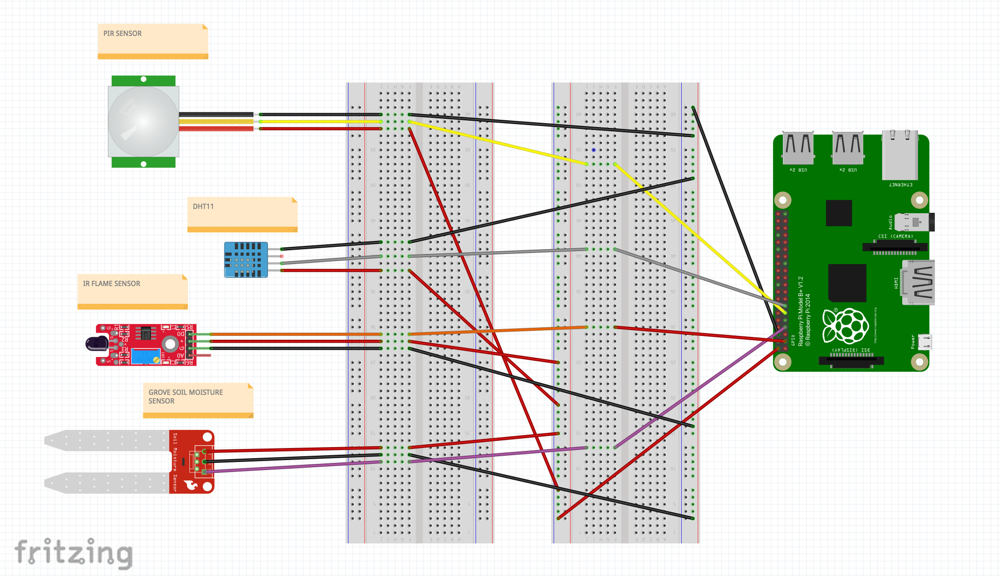

# Getting Started with the Intrusion Detection and Server Module 

Intrusion refers to an occasion when someone goes into a place or situation where they are not wanted or expected to be. Intrusion in one's field is the most common issues that a farmer face. Hence to solve it to an extent where a farmer could be notified immediately

The server was built using **flask** which will be running on the **Raspberry Pi** which will be equipped with the following sensors 

- **PIR Sensor**: PIR sensors allow you to sense motion, almost always used to detect whether a human has moved in or out of the sensors range.

- **Grove Soil Moisture Sensor**: Moisture Senor can be used for detecting the moisture of soil or judge if there is water around the sensor, let the plant in your garden able to reach out for human's help when they are thirsty.

- **DHT 11 Temperature and Humidity Sensor**: The DHT11 is a basic, ultra low-cost digital temperature and humidity sensor. It uses a capacitive humidity sensor and a thermistor to measure the surrounding air and spits out a digital signal on the data pin (no analog input pins needed)

- **Flame Sensor**: A flame-sensor is one kind of detector which is mainly designed for detecting as well as responding to the occurrence of a fire or flame. The flame detection response can depend on its fitting. It includes an alarm system, a natural gas line, propane & a fire suppression system.

## <u>Folder Structure</u>

The module directory contains 2 important folders and files 

1. app.py: Contains an executable python script that contains **gpio** implications along with **flask** server that will be sent to the **agrobuddy** mobile application. 

2. README.md: A readme file about this module 

## <u>More about GPIO</u>:

A general-purpose input/output (GPIO) is an uncommitted digital signal pin on an integrated circuit or electronic circuit board which may be used as an input or output, or both, and is controllable by software.

GPIOs have no predefined purpose and are unused by default. If used, the purpose and behavior of a GPIO is defined and implemented by the designer of higher assembly-level circuitry: the circuit board designer in the case of integrated circuit GPIOs, or system integrator in the case of board-level GPIOs.

Inorder to use GPIO with Raspberry Pi we need to install a dedicated GPIO package called as RPi.GPIO 

## Working with RPi.GPIO 

Install the RPi.GPIO package from pypi.org to get started with GPIO librart

    $ pip install RPi.GPIO

In RPi.GPIO you can use either pin numbers (BOARD) or the Broadcom GPIO numbers (BCM), but you can only use one system in each program. I habitually use the GPIO numbers, but neither way is wrong. Both have advantages and disadvantages.

If you use pin numbers, you don’t have to bother about revision checking, as RPi.GPIO takes care of that for you. You still need to be aware of which pins you can and can’t use though, since some are power and GND.

If you use GPIO numbers, your scripts will make better sense if you use a Gertboard, which also uses GPIO numbering. If you want to use the P5 header for GPIO28-31, you have to use GPIO numbering. If you want to control the LED on a Pi camera board (GPIO5) you also have to use GPIO numbering.

## Expanding the Circuit 

Raspberry Pi contains 40 pins which also acts a power source to Sensors via pins **1**,**2**,**4**. 

For the current project, we are using the Raspberry Pi GPIO in Broadcast Mode (BCM). We are using the following GPIO Inputs 

    GPIO.setmode(GPIO.BCM)

    PIR_input = 17  # Input to PIR Input
    Flame_input = 2 # Input to Flame Sensor
    Soil_Moisture_pin = 4 #Input to Soil Moisture Sensor
    temp_and_humid_Sensor = Adafruit_DHT.DHT11 # Using Adafruit Supported DHT11 sensor kit
    temp_pin = 27 # Input to Temperature and Humidity Sensor

## How does this module work ? : 

 The flask server is set to default route *"/"*, and an instance of sensor data class is Invoked. 

Data from sensors are collected and stored in a dictionary which is then converted to **JSON** while passing to the Mobile application. 

- The **PIR** Sensor works on a Boolean Flag method where when ever it detects any motion within its range, it turns the flag value as **True** and returns to the program. We store this flag value and return it to the application.

- The **Flame** Sensor also works on a Boolean Flag method where when ever it detects any flame/smoke within its range, it turns the flag value as **True** and returns to the program. We store this flag value and return it to the application. 

- The **Soil Moisture** Sensor also works on a Boolean Flag method where when ever it detects moisture levels, it turns the flag value as **True** and returns to the program. We store this flag value and return it to the application.

- The **DHT 11** sensor collects the temperature and humidity of the environment and returns it to the application. 

The underlying flask server which contains a dictionary returns sensor data as a ***"key-value"*** pair. This Keys are accessed in the mobile application to display the values on UI. 

## Further Developments: 

To execute the module we are using the device's local IP and public IP address which would not be a good option considering scalability therefore we need to think of a design or an approach (which currently we are unaware of) where we would not have to use IP address's as it could be dangerous if revealed.