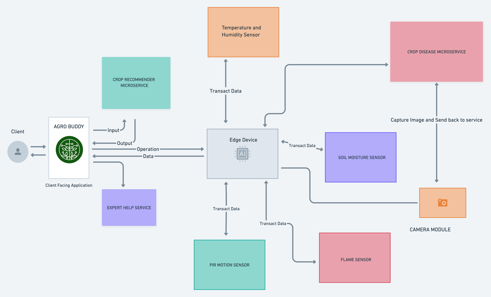
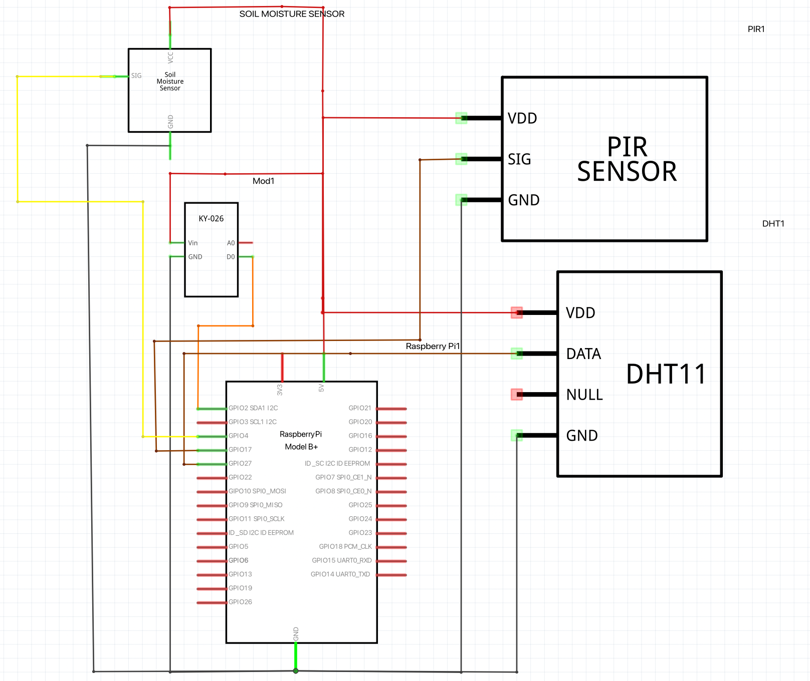
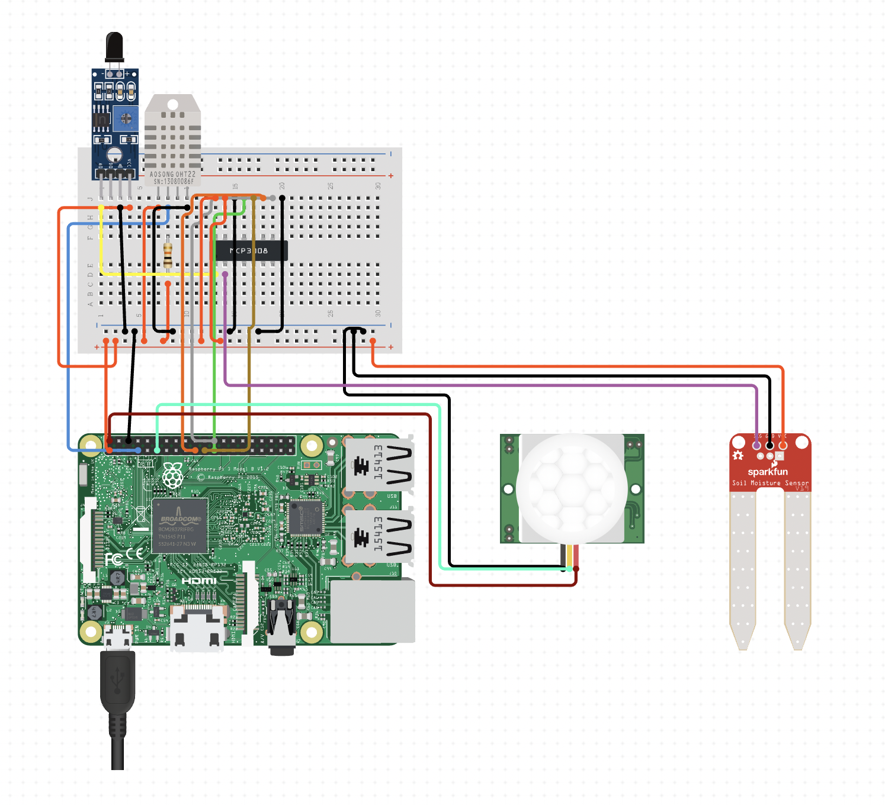

# <u>Agrobuddy </u>

 
 

Agrobuddy is project built using the Edge-AI paradigm which is an amalgamation of two completely different technologies into creating one new entity. 

Edge AI paradigm consists of: 
    1. Edge Device (Hardware)
    2. AI Inference 

        Edge Computing + AI Algorithm (to run inference) = EDGE AI

### Edge Computing 

Edge computing is a distributed information technology (IT) architecture in which client data is processed at the periphery of the network, as close to the originating source as possible. 

Edge computing is all a matter of location. In traditional enterprise computing, data is produced at a client endpoint, such as a user's computer. That data is moved across a WAN such as the internet, through the corporate LAN, where the data is stored and worked upon by an enterprise application. Results of that work are then conveyed back to the client endpoint. This remains a proven and time-tested approach to client-server computing for most typical business applications.

### AI Inference 

AI Inference is achieved through an “inference engine” that applies logical rules to the knowledge base to evaluate and analyze new information. In the process of machine learning, there are two phases. First, is the training phase where intelligence is developed by recording, storing, and labeling information.

### Edge AI : 

Edge AI is the deployment of AI applications in devices throughout the physical world. It’s called “edge AI” because the AI computation is done near the user at the edge of the network, close to where the data is located, rather than centrally in a cloud computing facility or private data center.

Since the internet has global reach, the edge of the network can connote any location. It can be a retail store, factory, hospital or devices all around us, like traffic lights, autonomous machines and phones.

## <u>Problem Statement</u> 

The Goal of the Application/ Project is to help a farmer/ farming industry right from the beginning i.e. deciding on what crop to grow how to grow till the day of harvest. Additionally, the application will also support the farmer by notifying them in case of attack by an external entity, performing regular checks on the plant to detect visible disease. 

#### The project has various modules that perform various services such as 

- **Crop recommender module:**  Helps farmers identify the right crop for their field based on the nutritional value of the soil.
- **Intrusion detection module:** Helps in detecting trespassing activities in the fields.
- **Object Detection Module:** Helps to Identify the what object has intruded into the field and notify to farmer accordingly.
- **Plant disease prediction module:** Helps to predict the health of plants based on images of leaves.
- **Calamity detection module:** Helps to identify and prevent crop damage during fire hazards and similar calamities.

## <u>Architecture of our application</u> 

## <u>1. Crop Recommender Module</u>

Crop recommender is a module built to recommend the best possible crop to a user based on the soil conditions. 

The user needs to provide a few details such as 

- Nitrogen (N)
- Phosphorus (P)
- Potassium (K)
- Temperature of the Region 
- Humidity 
- Ph of Soil 
- Rainfall (mm)

### More information about the algorithm being used: 

Since the task was to classify the best crop to be grown based on the input values, the K-Nearest Neighbour Algorithm for machine learning was used. 

- #### Reasons behind K-NN 
  - K-Nearest Neighbour is one of the simplest Machine Learning algorithms based on Supervised Learning technique.
  - K-NN algorithm assumes the similarity between the new case/data and available cases and put the new case into the category that is most similar to the available categories.
  - K-NN algorithm stores all the available data and classifies a new data point based on the similarity. This means when new data appears then it can be easily classified into a well suite category by using K- NN algorithm.
  - K-NN algorithm can be used for Regression as well as for Classification but mostly it is used for the Classification problems.
  - K-NN is a non-parametric algorithm, which means it does not make any assumption on underlying data.
  - It is also called a lazy learner algorithm because it does not learn from the training set immediately instead it stores the dataset and at the time of classification, it performs an action on the dataset.
  - KNN algorithm at the training phase just stores the dataset and when it gets new data, then it classifies that data into a category that is much similar to the new data.

### More about the dataset:

Precision agriculture is in trend nowadays. It helps the farmers to get informed decision about the farming strategy. Here,the dataset contains various useful metrics such as **N**, **P**, **K**,**Temperature**, **Humidity**, **PH**, **Rainfall** which would help us build a predictive model  to recommend the most suitable crops to grow in a particular farm based on various parameters.
 
  - This dataset was build by augmenting datasets of rainfall, climate and fertilizer data available for India (The data and results may vary from country to country).

## <u>2. Intrusion Detection Module</u>

Intrusion refers to an occasion when someone goes into a place or situation where they are not wanted or expected to be. Intrusion in one's field is the most common issues that a farmer face. Hence to solve it to an extent where a farmer could be notified immediately

The server was built using **flask** which will be running on the **Raspberry Pi** which will be equipped with the following sensors 

- **PIR Sensor**: PIR sensors allow you to sense motion, almost always used to detect whether a human has moved in or out of the sensors range.

- **Grove Soil Moisture Sensor**: Moisture Senor can be used for detecting the moisture of soil or judge if there is water around the sensor, let the plant in your garden able to reach out for human's help when they are thirsty.

- **DHT 11 Temperature and Humidity Sensor**: The DHT11 is a basic, ultra low-cost digital temperature and humidity sensor. It uses a capacitive humidity sensor and a thermistor to measure the surrounding air and spits out a digital signal on the data pin (no analog input pins needed)

- **Flame Sensor**: A flame-sensor is one kind of detector which is mainly designed for detecting as well as responding to the occurrence of a fire or flame. The flame detection response can depend on its fitting. It includes an alarm system, a natural gas line, propane & a fire suppression system.

### Working with RPi.GPIO 

Install the RPi.GPIO package from pypi.org to get started with GPIO librart

    $ pip install RPi.GPIO

In RPi.GPIO you can use either pin numbers (BOARD) or the Broadcom GPIO numbers (BCM), but you can only use one system in each program. I habitually use the GPIO numbers, but neither way is wrong. Both have advantages and disadvantages.

If you use pin numbers, you don’t have to bother about revision checking, as RPi.GPIO takes care of that for you. You still need to be aware of which pins you can and can’t use though, since some are power and GND.

If you use GPIO numbers, your scripts will make better sense if you use a Gertboard, which also uses GPIO numbering. If you want to use the P5 header for GPIO28-31, you have to use GPIO numbering. If you want to control the LED on a Pi camera board (GPIO5) you also have to use GPIO numbering.

### Expanding the Circuit 

Raspberry Pi contains 40 pins which also acts a power source to Sensors via pins **1**,**2**,**4**. 

For the current project, we are using the Raspberry Pi GPIO in Broadcast Mode (BCM). We are using the following GPIO Inputs 

    GPIO.setmode(GPIO.BCM)

    PIR_input = 17  # Input to PIR Input
    Flame_input = 2 # Input to Flame Sensor
    Soil_Moisture_pin = 4 #Input to Soil Moisture Sensor
    temp_and_humid_Sensor = Adafruit_DHT.DHT11 # Using Adafruit Supported DHT11 sensor kit
    temp_pin = 27 # Input to Temperature and Humidity Sensor

### Hardware Architecture Schematic 

#### Circuit Diagram 

### How does this module work ? : 

 The flask server is set to default route *"/"*, and an instance of sensor data class is Invoked. 

Data from sensors are collected and stored in a dictionary which is then converted to **JSON** while passing to the Mobile application. 

- The **PIR** Sensor works on a Boolean Flag method where when ever it detects any motion within its range, it turns the flag value as **True** and returns to the program. We store this flag value and return it to the application.

- The **Flame** Sensor also works on a Boolean Flag method where when ever it detects any flame/smoke within its range, it turns the flag value as **True** and returns to the program. We store this flag value and return it to the application. 

- The **Soil Moisture** Sensor also works on a Boolean Flag method where when ever it detects moisture levels, it turns the flag value as **True** and returns to the program. We store this flag value and return it to the application.

- The **DHT 11** sensor collects the temperature and humidity of the environment and returns it to the application. 

The underlying flask server which contains a dictionary returns sensor data as a ***"key-value"*** pair. This Keys are accessed in the mobile application to display the values on UI. 

## <u>3. Object Detection Module</u>

Object recognition is a general term to describe a collection of related computer vision tasks that involve identifying objects in digital photographs.

Image classification involves predicting the class of one object in an image. Object localization refers to identifying the location of one or more objects in an image and drawing abounding box around their extent. Object detection combines these two tasks and localizes and classifies one or more objects in an image.

Object Detection is one of the inference module in the project **Agrobuddy** and uses MobilenetSSD pretrained weights along the COCO dataset. 

### More about SSD Mobinet : 

MobilenetSSD is an object detection model that computes the bounding box and category of an object from an input image. This Single Shot Detector (SSD) object detection model uses Mobilenet as backbone and can achieve fast object detection optimized for mobile devices. 

MobilenetSSDtakes a (3,300,300) image as input and outputs (1,3000,4) boxes and (1,3000,21) scores. Boxes contains offset values (cx,cy,w,h) from the default box. Scores contains confidence values for the presence of each of the 20 object categories, the value 0 being reserved for the background.

  - #### Internal Configuration MobinetSSD:
        image_size = 300
        image_mean = np.array([127, 127, 127]) # RGB layout
        image_std = 128.0
        iou_threshold = 0.45
        center_variance = 0.1
        size_variance = 0.2

        specs = [
        SSDSpec(19, 16, SSDBoxSizes(60, 105), [2, 3]),
        SSDSpec(10, 32, SSDBoxSizes(105, 150), [2, 3]),
        SSDSpec(5, 64, SSDBoxSizes(150, 195), [2, 3]),
        SSDSpec(3, 100, SSDBoxSizes(195, 240), [2, 3]),
        SSDSpec(2, 150, SSDBoxSizes(240, 285), [2, 3]),
        SSDSpec(1, 300, SSDBoxSizes(285, 330), [2, 3])
        ]

In SSD, after extracting the features using an arbitrary backbone, the bounding boxes are calculated at each resolution while reducing the resolution with Extra Feature Layers. MobilenetSSD will concatenate the output of the six levels of resolution and calculate a total of 3000 bounding boxes, and finally, filter out bounding boxes using non-maximum suppression (nms).

### Understanding the Code: 

1. **The .dnn_DetectionModel()** : It is a deep neural network model that helps in loading a pretrained model, (ssd-mobilenet in our case). The DNN module allows loading pre-trained models of most popular deep learning frameworks, including Tensorflow, Caffe, Darknet, Torch.

2. **What is a bbox?** 
The b in bbox is for bounding. Bounding boxes can be useful as standalone shapes, but they are primarily used for approximating more complex shapes to speed operations.

3. **Why are we using the .flatten() ?**
Flattening lists in python means converting multidimensional lists into one-dimensional lists. It is basically a method of merging all the sublists of a nested list into one unified list.

As we now know that coco.names has 80 object categories, we need to a way to retrieve these names so that we can use them. This is where we can use file handling and string methods. We read our file using f.read(), remove or strip the spaces on the right-side of words using .rstrip(\n) and separated words by breaking lines where there is space using split(\n). Refer to string methods to get a proper grasp on these concepts.

## <u>4. Plant Disease Detection Module</u>

The plant disease detection module is built to detect diseases in the following plants based on the Underlying Dataset. 

The module was built using tensorflow, keras and built on top of **VGG19 model** weights. 

The Dataset contains augumented images of various crop leaves such as 

- Apple 
- Blueberry
- Cherry 
- Corn 
- Grape 
- Orange 
- Peach 
- Pepper
- Potato
- Raspberry 
- Soybean
- Squash
- Strawberry 
- Tomato

And **38** different types of diseases such as 

    -> Scab
    -> Rot
    -> Rust 
    -> Sour
    -> Powdery
    -> Leaf Spots
    -> Common Rust
    -> Black Rot
    -> Black Measels
    -> Citrus Greening
    -> Healthy
    -> Bacteria 
    and many more 

 

The module contains a trained model using VGG19 that has been trained on a dataset using deep learning. 

Several precautionary measures have been taken while building the model such as adding **ModelCheckpoints** to avoid **Over Fitting** the model. The Model has been compiled with 15 steps per epoch for both training and validation for almost 50 epochs. 

After several tries, the maximum number of epochs it can run is 15 inorder to prevent model from over fitting and reducing biases. 

### More about the VGG19 Model: 

VGG-19 is a convolutional neural network that is 19 layers deep. VGG19 is an advanced CNN with pre-trained layers and a great understanding of what defines an image in terms of shape, color, and structure. VGG19 is very deep and has been trained on millions of diverse images with complex classification tasks.

### Where is the module deployed ? 

The module is deployed on the edge device itself which supports and has a dedicated hardware accerlerated GPU for thr image processing to happen. Since we are using Raspberry pi 3 as the edge device, it has low computation power and therefore, it makes it difficult to process data at a faster rate therefore on the future stages edge devices will be equipped with a hardware accelerated GPU such as Nvidia Jetson Nano, Google Edge TPU USB Accelerator, etc to run the inference engine on the edge. 

## <u>5. Calamity detection module</u> 

The Calamity detection module uses the sensors equipped on the edge device to detect when there is a calamity or hazards such as fire or flood, etc. 

### How does this module work? 

The sensors equipped on the device collects data in realtime and sends data to the client facing application. The Edge Device contains Flame Sensor which detects in case of fire returns the flag as **true** which will notify the user thus keeping him informed about calamity happening at his/her field. 

## <u>Future Developments</u>

- ***Crop Recommender:*** Since the current model is best suited for conditions in India, it would be better if we could provide solution that cater to a world wide audience. Hosting our code on a dedicated device with low latency could be another option.
- ***Server:*** We need a design or reengineer our approach (which currently we are unaware of) where we would not have to use IP addresses as it could be dangerous if revealed. To execute the module we are using the device's local IP and public IP address which would not be a good option considering scalability and security.
- ***Object Detection:*** The MobileNet has accuracy 65% in 100 epochs where as The Resnet-50 has accuracy 81% in 30 epochs. To make it more accurate, we would try and replace from Mobinet to Resnet. Also, the MobileNet does not fare well on object categories with small sizes.
- ***Plant Disease:*** Current Model is trained based on available types of crops and its diseases. However, It does not provide an answer for all types of plants or their diseases. We would collect data containing most of plants and the types of diseases it could have and then provide a solution to it.
- ***Plant Disease:*** The Raspberry pi 3 currently has low computation power and therefore, it makes it difficult to process data at a faster rate therefore on the future stages edge devices will be equipped with a hardware accelerated GPU such as Nvidia Jetson Nano, Google Edge TPU USB Accelerator, etc to run the inference engine on the edge. 

 