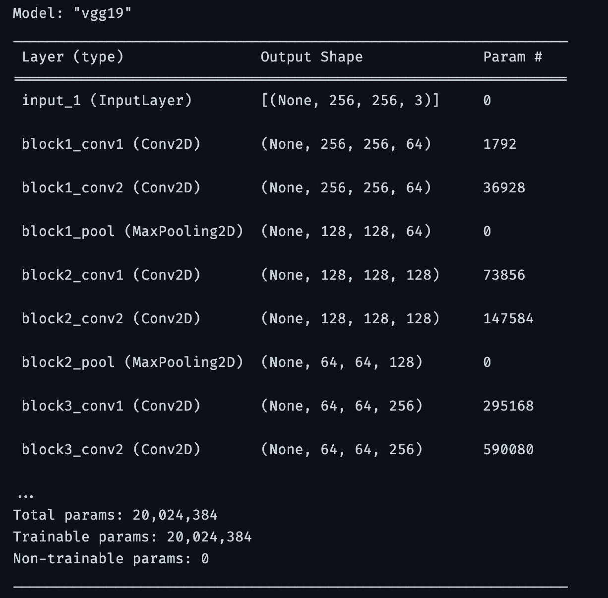

# Getting Started with the Plant Disease Module

The plant disease detection module is built to detect diseases in the following plants based on the Underlying Dataset. 

The module was built using tensorflow, keras and built on top of a pretrained **VGG19 model**

 
 
The Dataset contains augumented images of various crop leaves such as 

- Apple 
- Blueberry
- Cherry 
- Corn 
- Grape 
- Orange 
- Peach 
- Pepper
- Potato
- Raspberry 
- Soybean
- Squash
- Strawberry 
- Tomato

And **38** different types of diseases such as 

    -> Scab
    -> Rot
    -> Rust 
    -> Sour
    -> Powdery
    -> Leaf Spots
    -> Common Rust
    -> Black Rot
    -> Black Measels
    -> Citrus Greening
    -> Healthy
    -> Bacteria 
    and many more 

 

## Folder Structure: 

The module directory contains 5 important folders and files 

1. **Dataset**: Contains 87000+ images of leaves and diseases and has two sub directories 
   - train: Contains 38 Folders of Images with respect to certain diseases
   - valid: Contains 38 Folders of Validatory Images with respect to certain diseases
2. **Test**: Contains 38 images to test specific diseases to check the models accuracy and prediction
3. **Plant_Diease_Detection_Notebook.ipynb** : Contains a notebook implementing plant disease detection module. 
4. **model_best_acc.h5**: Has the weights of the trained model with an Accuracy of ***81.88%*** 
5. **plant_disease_detection_model.pkl**: Contains a model dumped inside a pickle file to prevent retraining of the model. 

## How to use the module: 

The module contains a trained model using VGG19 that has been trained on a dataset using deep learning. 

Several precautionary measures have been taken while building the model such as adding **ModelCheckpoints** to avoid **Over Fitting** the model. The Model has been compiled with 15 steps per epoch for both training and validation for almost 50 epochs. 

After several tries, the maximum number of epochs it can run is 15 inorder to prevent model from over fitting and reducing biases. 

The complete code for the module is in this <a href="./Plant_Diease_Detection_Notebook.ipynb">Notebook</a>, therefore for any changes and updates can be made to the file. 

The model is dumped on a pickle file called ***plant_disease_detection_model.pkl***. 

You may download or clone the module to get the hang of the model. 

## More about the VGG19 Model: 

VGG-19 is a convolutional neural network that is 19 layers deep. VGG19 is an advanced CNN with pre-trained layers and a great understanding of what defines an image in terms of shape, color, and structure. VGG19 is very deep and has been trained on millions of diverse images with complex classification tasks.

## Further Developments: 

Current Model is trained based on available types of crops and its diseases. However, It does not provide a solution to all types of plants and its diseases therefore for the further developments, we would collect data containing most of plants and the types of diseases it could have and then provide a solution to it. 

